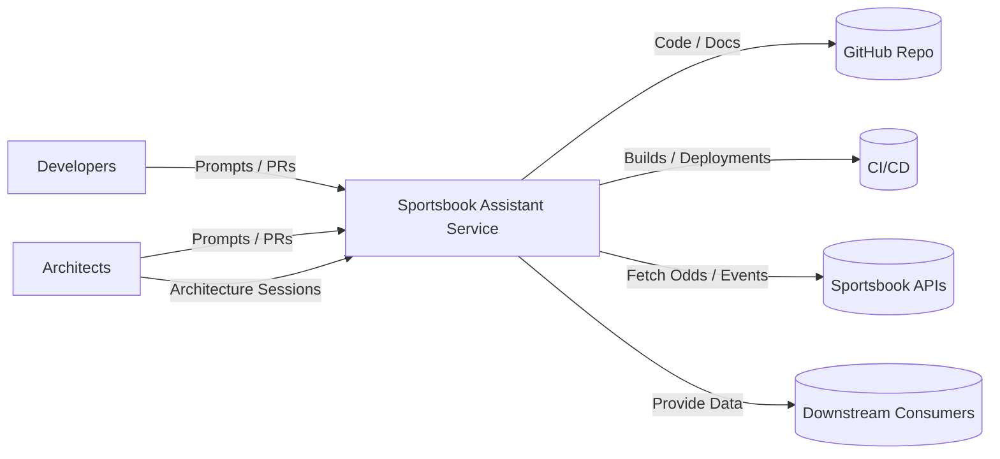

# System Context Diagram

## Overview

The Sportsbook Assistant Service is a C#/.NET backend service that provides intelligent assistance for sportsbook operations. It integrates with various external systems and serves multiple stakeholder groups.

## Stakeholders

### Developers
- **Role**: Build features, fix bugs, and maintain the codebase.
- **Interactions**: Submit code through pull requests, use Copilot agents for development assistance.

### Architects / Tech Leads
- **Role**: Guide architectural decisions, review designs, and maintain architectural documentation.
- **Interactions**: Conduct architecture sessions, review and approve ADRs, guide system evolution.

### Product / Operations
- **Role**: Define requirements, monitor system health, and ensure operational excellence.
- **Interactions**: Review system capabilities, monitor deployments and performance.

## External Systems

### GitHub Repository
- **Purpose**: Source code management, version control, and collaboration.
- **Integration**: Code commits, pull requests, issue tracking.

### CI/CD Pipeline
- **Purpose**: Automated build, test, and deployment processes.
- **Integration**: Triggered by code commits, deploys to target environments.
- **Note**: Specific CI/CD tooling (GitHub Actions, Azure DevOps, etc.) to be determined by the team.

### Sportsbook APIs
- **Purpose**: Upstream data sources providing odds, events, and sportsbook information.
- **Integration**: RESTful APIs or other protocols to fetch real-time sportsbook data.
- **Note**: Specific sportsbook API providers to be determined based on business requirements.

### Downstream Consumers
- **Purpose**: Applications or services that consume data from the Sportsbook Assistant Service.
- **Integration**: REST APIs, message queues, or other communication protocols.
- **Note**: Specific consumers to be identified as the service evolves.

## Context Diagram

## Key Interactions

1. **Development Flow**: Developers and architects interact with the service through code contributions and architecture discussions, leveraging GitHub Copilot agents.

2. **Code Management**: All code and documentation changes flow through GitHub, maintaining version history and enabling collaboration.

3. **Continuous Delivery**: CI/CD pipelines automatically build, test, and deploy the service to target environments.

4. **Data Integration**: The service fetches sportsbook data from upstream APIs and provides processed information to downstream consumers.

## Notes

This context diagram represents the high-level system boundaries. As the service evolves, specific external systems and integration patterns will be refined based on actual implementation decisions captured in ADRs.
